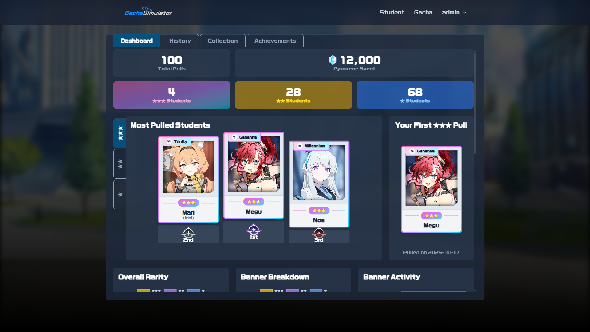

# Blue Archive Gacha Simulator

> **⚠️ Disclaimer**
>
> This is a fan-made, non-profit hobby project created purely for fun and educational purposes. There is no commercial benefit associated with this project. It is not affiliated with, authorized, or endorsed by Nexon Games, Yostar, or their affiliates in any way. All characters, images, and other intellectual property from Blue Archive are trademarks and copyrights of their respective owners.

A feature-rich web application built with Django and Tailwind CSS that simulates the gacha and character collection experience of the mobile game Blue Archive.

---

## 📸 Screenshots

| Home Page | Gacha Page | Banner Details |
| :---: | :---: | :---: |
|  |  |  |

| Single Pull | Ten Pulls | Result |
| :---: | :---: | :---: |
|  |  |  |

| Dashboard (part 1) | Dashboard (part 2) | Dashboard (part 3) |
| :---: | :---: | :---: |
|  |  |  |

---

## ✨ Features

This project goes beyond a simple gacha puller and implements a full suite of features found in modern web applications and games:

*   **Realistic Gacha Simulation:**
    *   Pull for students on different banners, each with unique rates and pickup characters.
    *   A high-impact, multi-stage "Prismatic Burst" animation for revealing rare (★★★) students, complete with foil shines and sparkle effects.
    *   Separate, secure API endpoints for single and multi-pulls.
    *   Full support for guest users (pulls are not saved).

*   **Dynamic User Dashboard:**
    *   A fully asynchronous, widget-based dashboard that loads data without page reloads.
    *   **KPI Widgets:** At-a-glance stats for total pulls, Pyroxene spent, and rarity breakdowns.
    *   **"Hall of Fame" Podium:** An interactive, tabbed widget showcasing the top 3 most-pulled students for each rarity in a dynamic podium layout.
    *   **Data Visualization:** Interactive charts (Doughnut, Bar) powered by Chart.js to visualize overall pull history and per-banner statistics.
    *   **In-Depth Analysis:** Detailed performance tables with per-banner luck variance and 3-star pull gap analysis.
    *   **Milestone Timeline:** A unique, responsive horizontal timeline that visually charts the user's journey of obtaining their first ★★★ students.

*   **Comprehensive Student Collection:**
    *   View all students in the game, grouped by rarity.
    *   Obtained students are highlighted, while un-obtained students are shown with a "locked" overlay.
    *   Includes a client-side filtering system to view "All," "Obtained," or "Not Obtained" students instantly.

*   **Achievement & Progression System:**
    *   A complete backend service for checking and awarding achievements.
    *   **Collection Achievements:** Awarded for completing sets of students (e.g., "Collect all of the Abydos Task Force").
    *   **Milestone Achievements:** Awarded for reaching pull count milestones (10, 100, 1000 pulls).
    *   **Feats of Luck Achievements:** Special awards for rare events, like getting multiple 3-star students in a single 10-pull.
    *   **Toast Notifications:** Unlocked achievements appear as non-intrusive "toast" popups on the screen in real-time.

*   **Full User Authentication:**
    *   Secure user registration and login system powered by Django's built-in auth.
    *   All gacha history, inventory, and achievements are tied to the user account.

---

## 🛠️ Tech Stack

*   **Backend:** Django, Python
*   **Database:** SQLite (default)
*   **Frontend:** HTML, Tailwind CSS
*   **JavaScript:** Vanilla JavaScript (ES6+), Alpine.js (for navbar interactivity), Chart.js (for data visualization)
*   **Architecture:** Asynchronous widget-based loading, stateless service classes for core logic (Gacha Engine, Achievement Service).

---

## 🚀 Getting Started

This project can be run in two ways: directly from the source code (recommended for development) or with Docker Compose (recommended for a quick and consistent setup).

### Environment Configuration

This project is configured using environment variables in [settings.py](Blue_Archive_Gacha_Simulator/settings.py).<br>
For local development, **no configuration is needed.** The defaults are pre-configured to use a local `db.sqlite3` file and run in `DEBUG` mode.

---

### Method 1: Running from Source Code

This method gives you a direct development environment on your local machine.

1.  **Clone the repository** and `cd` into it.
    ```sh
    git clone https://github.com/catptype/Blue-Archive-Gacha-Simulator-V2.git
    ```
2.  **Create and activate a Python virtual environment** using your preferred tool (e.g., `venv`, `conda`).
3.  **Install dependencies:**
    ```sh
    pip install -r requirements.txt
    ```
4.  **Initialize the database:**
    ```sh
    python manage.py migrate
    python manage.py unpack
    python manage.py createsuperuser
    ```
5.  **Run the development server:**
    ```sh
    python manage.py runserver 0.0.0.0:8000
    ```
The application will be available at `http://localhost:8000/`.

---

### Method 2: Running with Docker Compose (Easy Setup)

This method runs the entire application inside a container. The `Dockerfile` is configured to automatically handle all setup steps.

1.  **Clone the repository** and `cd` into it.
    ```sh
    git clone https://github.com/catptype/Blue-Archive-Gacha-Simulator-V2.git
    ```

2.  **Build and start the application:**
    This single command will build the Docker image and start the web service in the background.
    ```sh
    docker-compose up --build -d
    ```

3.  **Done!**
    The application is now fully initialized and available at `http://localhost:8000/`.

    > **Note:** The `Dockerfile` is configured to automatically run database migrations, unpack all initial data, and create a default superuser (`admin`/`1234`) during the image build process. **No manual setup commands are required.**

---

## 📄 Resources

The visual assets and fonts used in this project were sourced from the following excellent community resources.

*   [Student Images Asset](https://bluearchive.wiki/wiki/Characters): Source for student character portraits and artworks.
*   [Web Logo Generator](https://tmp.nulla.top/ba-logo/): A tool for generating web logos related to Blue Archive.
*   [RoGSanSrfStd-Bd Font](https://www.ffonts.net/RoGSanSrfStd-Bd.font): The font used in the project for a specific style or branding.

---

